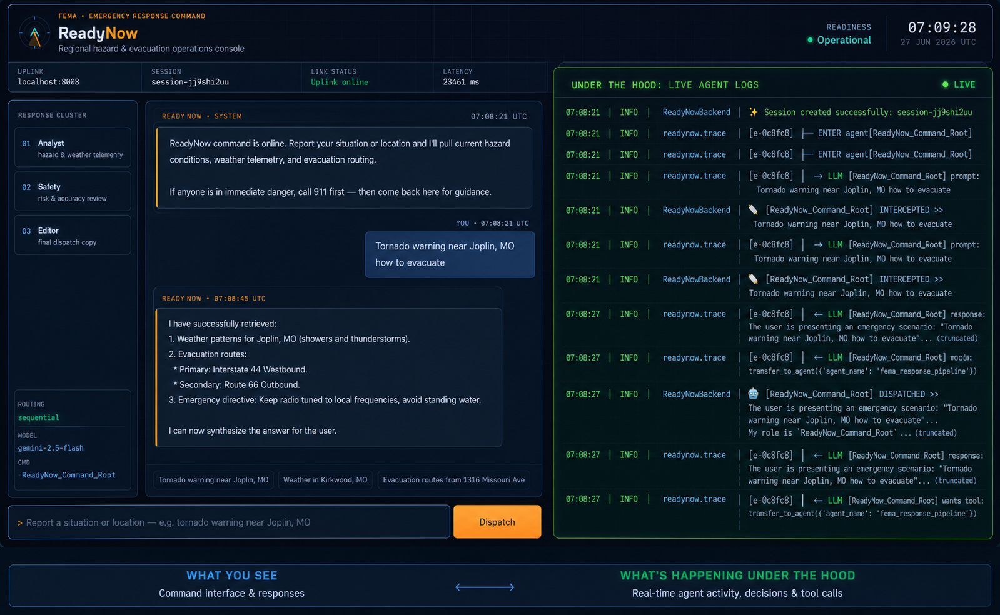
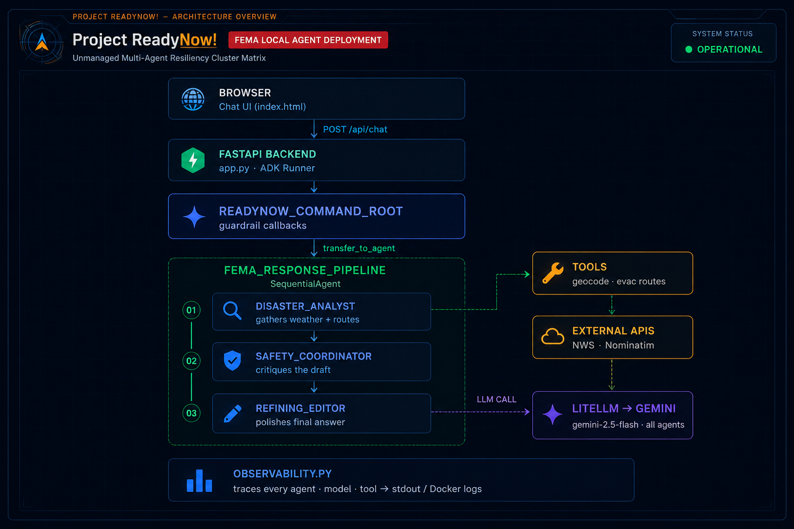

# ⚡ Project ReadyNow! — FEMA Emergency AI Assistant

Nathan Verrill, June 2026

### _Google Cloud ADK Skills Validation Workshop — Challenge Six Capstone_

[](https://google.github.io/adk-docs/)
[](https://www.python.org/)
[](https://opensource.org/licenses/MIT)

---

## 📚 Workshop Challenges

This capstone is the final stage of a five-part series. The earlier challenges are Jupyter notebooks in the [`notebooks/`](../notebooks/) folder:

| Challenge | Notebook                                           |
| :-------- | :------------------------------------------------- |
| 1         | [`challenge1.ipynb`](./notebooks/challenge1.ipynb) |
| 2         | [`challenge2.ipynb`](./notebooks/challenge2.ipynb) |
| 3         | [`challenge3.ipynb`](./notebooks/challenge3.ipynb) |
| 4         | [`challenge4.ipynb`](./notebooks/challenge4.ipynb) |
| 5         | [`challenge5.ipynb`](./notebooks/challenge5.ipynb) |
| **6**     | **Project ReadyNow!** (this directory)             |

---

## 📌 Overview



**Project ReadyNow!** is an emergency-response assistant built for the **Federal Emergency Management Agency (FEMA)** use case. It runs on the **Google Agent Development Kit (ADK)**, is served through a **FastAPI** backend, and ships in **Docker** for reproducible local runs.

The system acts as an authoritative, empathetic, rapid-response assistant during natural disasters. Given a user's location and situation, it:

- Geocodes the location (Google Maps API, with an OpenStreetMap/Nominatim fallback)
- Pulls a live forecast from the **National Weather Service (NWS)** API
- Generates evacuation routing guidance
- Returns a single, polished, action-oriented safety briefing

A custom command-center frontend visualizes the multi-agent pipeline in real time.

---

## 🏗️ Architecture



Every agent and tool in the tree is instrumented by `observability.py`, which emits
structured `ENTER`/`EXIT`, prompt, and tool-call traces to stdout for `docker logs`.

---

## 🧩 Requirements → Implementation

How each Challenge 6 rubric requirement maps to the code:

| Requirement                         | File / Component                                 | Implementation                                                                                                                               |
| :---------------------------------- | :----------------------------------------------- | :------------------------------------------------------------------------------------------------------------------------------------------- |
| **1. Authoritative root persona**   | `backend/app.py` → `ReadyNow_Command_Root`       | A supervisor `Agent` with a reassuring, command-centric FEMA persona that parses context and delegates.                                      |
| **2. Multi-agent team**             | `backend/app.py` → `fema_response_pipeline`      | A `SequentialAgent` chaining data retrieval → safety review → final editing as isolated sub-agents.                                          |
| **3. Weather grounding**            | `backend/app.py` → `geocode_and_get_weather`     | Calls the live National Weather Service API using point coordinates.                                                                         |
| **4. Evacuation routing**           | `backend/app.py` → `calculate_evacuation_routes` | Produces actionable primary/secondary routes and safety directives.                                                                          |
| **5. Resilient geocoding**          | `backend/app.py` → `geocode_and_get_weather`     | Uses **Google Maps Geocoding** when `GOOGLE_API_KEY` is set, falling back to **Nominatim (OpenStreetMap)** so the tool never hard-fails.     |
| **6. Input guardrails**             | `backend/app.py` → `custom_before_callback`      | Intercepts payloads before generation; blocks non-US locations (NWS constraint) and off-mission requests (poems, string ops, recipes, etc.). |
| **7. Full-lifecycle observability** | `backend/observability.py`                       | Recursively attaches tracing callbacks to the entire agent tree (agent / model / tool hooks) and logs to stdout.                             |

---

## 🚀 Quickstart

### Prerequisites

- [Docker](https://www.docker.com/) with Docker Compose
- A **Gemini API key** ([Google AI Studio](https://aistudio.google.com/app/apikey))

### 1. Set environment variables

```bash
# Required — used by LiteLlm to reach Gemini
export GEMINI_API_KEY="your-gemini-api-key"

# Optional — enables premium Google Maps geocoding (otherwise falls back to Nominatim)
export GOOGLE_API_KEY="your-google-maps-api-key"

# Optional — identifies your session in the NWS/Nominatim User-Agent header
export QWIKLABS_USER="student-fema-session@qwiklabs.net"
```

> The repo also reads `GOOGLE_API_KEY` inside the geocoding tool. If you only set
> `GEMINI_API_KEY`, the agent still works — geocoding simply uses the free
> Nominatim fallback.

### 2. Build and run

```bash
docker compose up --build
```

This starts two services:

| Service                          | Container                 | Host port → container port |
| :------------------------------- | :------------------------ | :------------------------- |
| `backend-engine` (FastAPI + ADK) | `readynow_backend_engine` | `8008` → `8000`            |
| `frontend-ui` (Nginx)            | `readynow_frontend_ui`    | `9009` → `80`              |

### 3. Open the console

Navigate to:

```text
http://localhost:9009
```

The backend API is available directly at `http://localhost:8008/api/chat`.

### Try a prompt

- `Tornado warning near Joplin, MO`
- `Weather in Kirkwood, MO`
- `Evacuation routes from 1316 Missouri Ave`

---

## 🔌 API

**`POST /api/chat`**

Request:

```json
{
  "user_id": "local-operator",
  "session_id": "session-abc123",
  "message": "There's a tornado warning near Joplin, MO — where do I evacuate?"
}
```

Response:

```json
{
  "status": "success",
  "response": "..."
}
```

---

## 🔬 Observability

`observability.py` walks the full agent tree and chains tracing callbacks ahead of
the app's own guardrail callbacks, so the real prompt is logged before any rewrite.
A typical handoff looks like this in `docker logs`:

```text
06:40:47 | INFO | readynow.trace  | [e-61c926] ┌─ ENTER agent[ReadyNow_Command_Root]
06:40:47 | INFO | readynow.trace  | [e-61c926] │  → LLM  [ReadyNow_Command_Root] prompt: There's a tornado warning near Joplin, MO...
06:40:47 | INFO | ReadyNowBackend | 📝 [ReadyNow_Command_Root] INTERCEPTED >> There's a tornado warning near Joplin, MO...
06:40:54 | INFO | readynow.trace  | [e-61c926] │  ← LLM  [ReadyNow_Command_Root] wants tool: transfer_to_agent({'agent_name': 'fema_response_pipeline'})
06:40:54 | INFO | readynow.trace  | [e-61c926] │  ⚙ TOOL  [ReadyNow_Command_Root] call transfer_to_agent args={'agent_name': 'fema_response_pipeline'}
06:40:54 | INFO | readynow.trace  | [e-61c926] ┌─ ENTER agent[fema_response_pipeline]
```

A longer captured trace is available in [`example_agentlog.txt`](./example_agentlog.txt).

---

## 📁 Repository Layout

```text
challenge6/
├── Dockerfile.backend       # Python 3.12 image for the FastAPI + ADK backend
├── docker-compose.yml       # Backend + Nginx frontend service definitions
├── requirements.txt         # Top-level Python dependencies
├── example_agentlog.txt     # Sample full-lifecycle trace output
├── backend/
│   ├── app.py               # FastAPI app, ADK agents, tools, and guardrails
│   ├── observability.py     # Recursive multi-agent tracing utility
│   ├── deploy.py            # Deployment helper
│   └── requirements.txt     # Backend Python dependencies
└── frontend/
    └── index.html           # Single-file command-center UI
```

---

## ⚙️ Configuration

Environment variables (set via shell or `docker-compose.yml`):

| Variable              | Required | Default                             | Purpose                                                 |
| :-------------------- | :------- | :---------------------------------- | :------------------------------------------------------ |
| `GEMINI_API_KEY`      | ✅       | —                                   | Auth for Gemini via LiteLlm                             |
| `AGENT_MODEL_NAME`    | ❌       | `gemini/gemini-2.5-flash`           | Model used by all agents                                |
| `GOOGLE_API_KEY`      | ❌       | —                                   | Enables Google Maps geocoding (else Nominatim fallback) |
| `QWIKLABS_USER`       | ❌       | `student-fema-session@qwiklabs.net` | User-Agent identity for NWS/Nominatim                   |
| `LITELLM_NUM_RETRIES` | ❌       | `3`                                 | LiteLlm retry count                                     |

---

## 🛟 Troubleshooting

- **`Engine error 500` / quota messages** — the Gemini free tier has daily limits.
  Wait for the reset or swap in a new `GEMINI_API_KEY`.
- **`Link interrupt` in the UI** — confirm the backend container is running and
  reachable on `:8008` (`docker compose ps`).
- **Non-US location refused** — by design; NWS only covers US territories.
- **Off-topic request refused** — by design; the guardrail keeps the assistant on
  emergency-response tasks only.

---

## 🎓 Workshop Disclaimer

This repository is submitted as a validation artifact for the **Google Cloud Agentic
AI Skills Validation Program**. Its agent definitions, lifecycle hooks, and tool
structures are intended to demonstrate intermediate-to-advanced use of the **Google
Agent Development Kit (ADK)** in a containerized runtime.
